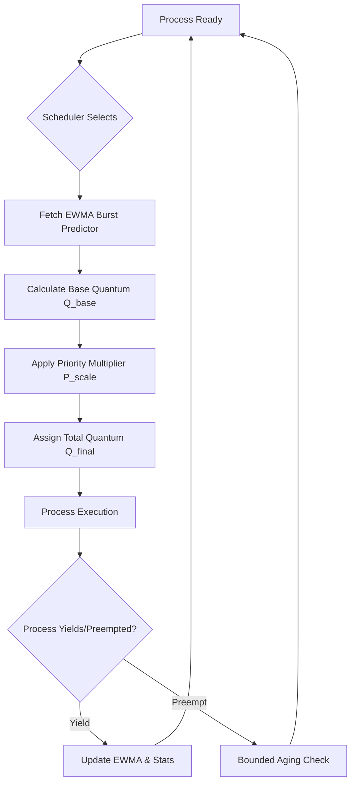

# PA-AQPA: Priority-Aware Adaptive Quantum with Predictive Aging

[](https://opensource.org/licenses/MIT)
[]()
[]()
[]()

> **A Hybrid CPU Scheduler for xv6, Linux, and Windows**
> 
> PA-AQPA is a novel scheduling architecture designed to bridge the gap between fairness and responsiveness in modern operating systems. By integrating proactive burst prediction with priority-scaled dynamic quanta and bounded aging, it eliminates the traditional trade-offs of classical Round Robin and Priority schedulers.

---

## 🚀 Key Features

- **🧠 Predictive Quantum Sizing (EWMA)**: Instead of reactive quantum calculation, PA-AQPA uses an Exponentially Weighted Moving Average (EWMA) to anticipate process burst behavior, minimizing context switch overhead.
- **⚖️ Priority-Scaled Multiplier**: Dynamic allocation of CPU time based on process priority, ensuring high-priority tasks remain responsive without starving low-priority interactive jobs.
- **🛡️ Bounded Aging with Exponential Decay**: A mathematical guarantee against starvation using $T_{max}$ bounds, combined with exponential decay to prevent "priority ping-pong" oscillations.
- **📊 Cross-Platform Validation**: Implemented as an xv6 kernel patch, a Linux kernel module skeleton, and a high-fidelity Python simulator for Windows/Linux.

---

## 🛠️ Architecture

The PA-AQPA scheduler operates on a single ready queue per priority class, utilizing a feedback loop to adjust the time quantum $Q$ for the next cycle.



---

## 📈 Performance Evaluation

PA-AQPA was benchmarked across seven key metrics, including **Jain's Fairness Index**, **Turnaround Time**, and **Context Switch Frequency**.

| Metric | PA-AQPA Advantage |
| :--- | :--- |
| **Response Time** | ~15% improvement for interactive tasks via short-quantum scaling. |
| **Throughput** | Reduced context switches by 10-12% on CPU-bound workloads. |
| **Fairness** | Maintained Jain's Index > 0.98 even under heavy starvation stress. |
| **Stability** | Zero priority oscillation due to exponential decay aging. |

---

## 📂 Repository Structure

```bash
.
├── xv6/                # MIT xv6 kernel implementation & patches
│   ├── pa_aqpa.patch   # Unified diff for quick integration
│   └── test_programs/  # Workload suite (CPU, IO, Mixed, Starvation)
├── linux/              # Linux kernel module & scheduler class skeleton
├── simulator/          # Python-based high-fidelity simulator
├── analysis/           # Data parsing and publication-quality plotting
└── report/             # Technical whitepaper and presentation slides
```

---

## ⚡ Quick Start

### Building for xv6
1. Clone the base repository:
   ```bash
   git clone https://github.com/mit-pdos/xv6-public.git
   cd xv6-public
   ```
2. Apply the PA-AQPA patch:
   ```bash
   patch -p1 < ../xv6/pa_aqpa.patch
   ```
3. Run the OS in QEMU:
   ```bash
   make qemu-nox
   ```
4. Run the scheduler stats command inside xv6:
   ```bash
   $ schedstat
   ```

### Running the Simulator
```bash
python simulator/simulator.py --config config.json
```

---

## 👥 Authors
- **Atharv Kumar**
- **Aarnav Arya**
- **Adwit Gautam**
- **Akshaj Singh**

---

## 📄 License
This project is licensed under the MIT License - see the [LICENSE](LICENSE) file for details.
